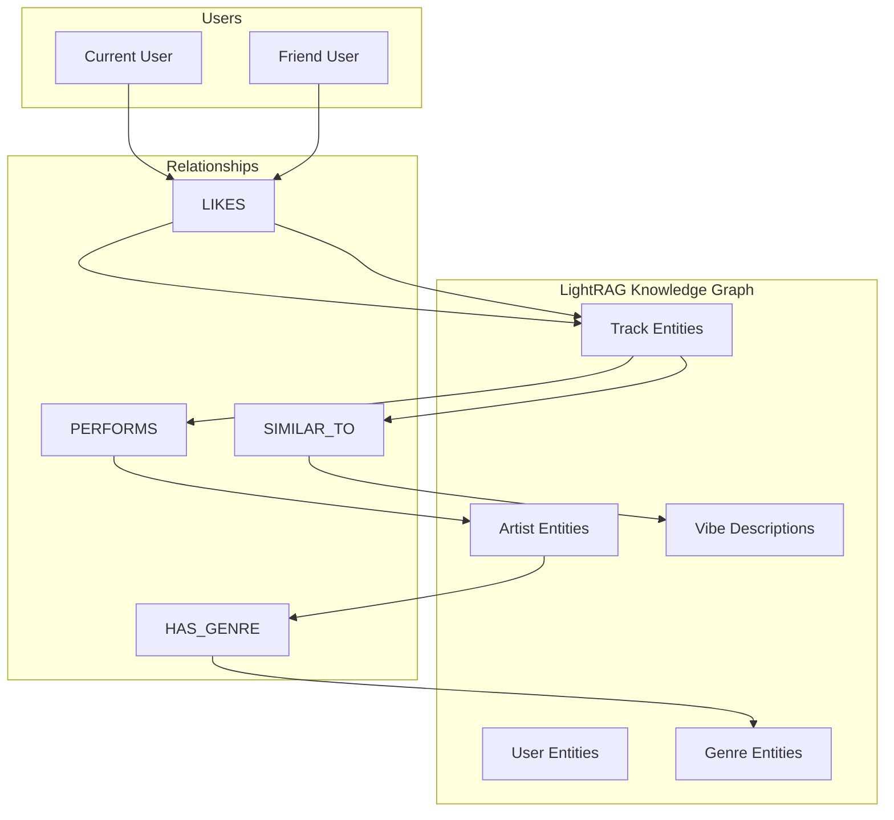

# 🎵 Project: Spotify Semantic Search (Deep Lyrics Edition)

## 📋 Overview

This project builds a semantic search engine for your Spotify "Liked Songs" library. It overcomes the deprecation of Spotify's Audio Features API and the lack of emotional context by combining three data sources:

1. **Spotify:** Base metadata (Title, Artist, Album).
2. **Genius:** Full song lyrics.
3. **LLM (AI):** Analyzes the cognitive dissonance between the musical genre and the lyrical meaning (e.g., "Happy sounding music with sad lyrics").

---

## 🛠 Tech Stack

### Core
- **Language:** Python 3.12+
- **Package Manager:** `uv`
- **Validation:** `Pydantic` (v2)
- **Dependency Injection:** `dependency-injector`

### AI & Vector Search
- **LLM:** `Ollama` (Llama 3.2 / Mistral) via OpenAI-compatible API
- **Embeddings:** `nomic-embed-text` (Ollama)
- **Vector Database:** `ChromaDB` (Local, persistent)
  - *Planned:* Migration to `LightRAG` for graph-based knowledge representation

### Data Sources
- **Spotify:** `spotipy` (Spotify Web API)
- **Lyrics:** `lyricsgenius` (Genius API wrapper)

### Frontend
- **Framework:** `Streamlit`
- **Styling:** Custom CSS

### Development
- **Testing:** `pytest`, `pytest-vcr`, `polyfactory`
- **Linting:** `ruff`, `pylint`, `mypy`
- **Tasks:** `poethepoet`


---

## 📅 Implementation Phases

### Phase 1: Environment & Credentials (x2)

You now need keys for two different kingdoms.

1. **Spotify App:** Get your `CLIENT_ID` and `CLIENT_SECRET` from the Spotify Developer Dashboard.
2. **Genius API:**

   - Go to [Genius API Clients](https://genius.com/api-clients).
   - Create an app to generate your `GENIUS_ACCESS_TOKEN`.

3. **Environment Setup:**

   - Create a `.env` file:

   ```ini
   SPOTIPY_CLIENT_ID="..."
   SPOTIPY_CLIENT_SECRET="..."
   SPOTIPY_REDIRECT_URI="http://localhost:8501/"
   GENIUS_ACCESS_TOKEN="..."
   OPENAI_API_KEY="sk-..."
   ```

### Phase 2: Data Ingestion (The Bottleneck)

This is where the slow magic happens. Downloading lyrics takes longer than fetching metadata.

1. **Fetch Spotify Data:**

   - Get the user's `Saved Tracks`.
   - Get the Artist's Genres (via Batch API call).

2. **Fetch Genius Data (New Step):**

   - Initialize: `genius = lyricsgenius.Genius(token)`.
   - **Search Strategy:** Iterate through the tracks.
   - _Sanitization:_ Clean the title before searching (remove "Remastered 2009", "- Live", etc.) to improve hit rate.
   - _Call:_ `song = genius.search_song(title, artist)`.
   - _Error Handling:_ If no lyrics are found or a timeout occurs, save `lyrics: "Not found/Instrumental"`.

### Phase 3: Deep Vibe Enrichment

The prompt is now much more sophisticated to leverage the textual data.

1. **Inference Logic:**

   - Function: `analyze_track_deeply(metadata, lyrics_text)`.
   - **Truncation:** Lyrics can be long. Truncate to the first 1000-1500 characters to save tokens; the chorus and main theme are usually found there.

2. **The Master Prompt:**
   > "Act as an expert music critic. Analyze this song:

   > - **Title:** {title}
   > - **Artist:** {artist}
   > - **Musical Genres:** {genres}
   > - **Lyrics Snippet:** "{lyrics_snippet}..."

   > **Task:**

   > 1. Detect the core theme of the lyrics (love, protest, grief, party).
   > 2. Contrast the lyrics with the musical genre (Is it a sad song with a happy rhythm?).
   > 3. Generate a synthetic **Vibe Description** for search purposes.

   > **Output:** Only the descriptive sentence."

3. **Result:** _"An Indie Pop track with an upbeat tempo, but the lyrics sarcastically address modern social isolation."_

### Phase 4: Vector Storage

Similar to the previous plan, but the embedding quality will be superior.

1. **Embed:** Use `text-embedding-3-small` on the generated description.
2. **Metadata:** Store `has_lyrics: bool` in ChromaDB so you can filter later if desired.

### Phase 5: Retrieval & Chat

The search flow remains, but the "DJ" response will be smarter.

1. **Query:** "I want songs that sound happy but are deep down sad."
2. **Match:** Thanks to the Phase 3 analysis, the system will find those songs with cognitive dissonance.
3. **Response:** The LLM can quote a line from the lyrics to justify its choice.

### Phase 6: UI with Progress Feedback

Since Genius is slow, the UI is critical.

1. **Real Progress Bar:**

   - In Streamlit, use `my_bar = st.progress(0)`.
   - Update the bar for each processed song (Spotify + Genius + OpenAI).

2. **Limit Control:**

   - Add a `slider` in the UI: _"How many recent songs to analyze?"_ (Default: 20, Max: 100).
   - _Warning:_ "Analyzing lyrics takes time (approx 2-3 seconds per song)."

3. **Display:**

   - Show the song card, and if lyrics were found, add a small _expander_ labeled "See AI Analysis" to show the generated explanation.


## 🚀 Definition of Done

1. **Login:** User logs in via Spotify.
2. **Config:** Select "Analyze last 10 songs".
3. **Wait:** User sees the progress bar advance while logs show _"Downloading lyrics for 'Bohemian Rhapsody'..."_.
4. **Chat:** User asks _"Which songs talk about making a mistake?"_.
5. **Result:** App returns specific songs based on lyrical content, not just the title.

---

## 🚀 Improvements & Feature Roadmap

### ✅ Completed Features

- [x] **Caching Strategy**: Implemented aggressive caching layer for Genius lyrics to reduce API hits on re-syncs.
- [x] **Incremental Sync**: Only analyze _newly added_ tracks instead of re-scanning the last N tracks every time.

---

## 🔧 Phase 7: Code Quality Improvements

> **Goal:** Enhance the current implementation with better practices, performance, and maintainability.

### 7.1 Error Handling & Resilience

- [ ] **Retry Logic with Exponential Backoff**: Add retry decorators to Genius and Spotify API calls.
  - **Files:** `infrastructure/genius/client.py`, `infrastructure/spotify/client.py`
  - **Implementation:** Use `tenacity` library for configurable retry policies.

- [ ] **Graceful Degradation**: Continue sync even if individual track enrichment fails.
  - **Files:** `services/library_sync.py`
  - **Current:** Partial implementation exists; ensure all exceptions are caught and logged.

- [ ] **Rate Limiting**: Implement rate limiter to respect API quotas.
  - **Files:** New file `utils/rate_limiter.py`
  - **Implementation:** Use token bucket algorithm for Genius API (5 req/sec limit).

### 7.2 Performance Optimizations

- [ ] **Async Batching for LLM Inference**: Process multiple tracks concurrently for faster sync.
  - **Files:** `services/track_analysis.py`, `infrastructure/llm/client.py`
  - **Implementation:** Use `asyncio` with configurable concurrency limit (default 3).

- [ ] **Batch Embedding Generation**: Generate embeddings in batches instead of one-by-one.
  - **Files:** `infrastructure/vectordb/repository.py`
  - **Current:** Uses Ollama's embedding function per-document.
  - **Improvement:** Batch up to 10 documents per embedding call.

- [ ] **Connection Pooling**: Reuse HTTP connections for external APIs.
  - **Files:** `infrastructure/genius/client.py`, `infrastructure/llm/client.py`
  - **Implementation:** Use `httpx` with persistent sessions.

### 7.3 Search Experience Enhancements

- [ ] **Filters**: Add explicit filters for Genre, Year, or Popularity range to narrow down semantic search.
  - **Files:** `services/search.py`, `ui/components/search.py`
  - **Implementation:** Add filter UI components and apply metadata filters in ChromaDB query.

- [ ] **Audio Preview**: Embedded Spotify web player widget to preview tracks instantly.
  - **Files:** `ui/components/library.py`, `ui/components/search.py`
  - **Implementation:** Use Spotify embed iframe with 30-second previews.

- [ ] **Playlist Creation**: One-click "Create Playlist" from search results directly to Spotify.
  - **Files:** `infrastructure/spotify/client.py`, `services/search.py`, `ui/components/search.py`
  - **Implementation:** Use Spotify API `user_playlist_add_tracks` endpoint.

### 7.4 UI/UX Improvements

- [ ] **Dark Mode Toggle**: Add theme switcher in sidebar.
  - **Files:** `ui/config.py`, `ui/styles/main.css`

- [ ] **Keyboard Shortcuts**: Add keyboard navigation for search results.
  - **Files:** `ui/components/search.py`

- [ ] **Export Search Results**: Download search results as JSON/CSV.
  - **Files:** `ui/components/search.py`

---

## 🆕 Phase 8: User Music Similarity Feature (LightRAG Integration)

> **Goal:** Enable users to compare their music taste with friends by adding their Spotify username, generating a similarity map, and providing cross-library recommendations.

### Why LightRAG instead of ChromaDB?

| Aspect | ChromaDB (Current) | LightRAG (Proposed) |
|--------|-------------------|---------------------|
| **Knowledge Model** | Flat vector embeddings | Graph-based entities + relationships |
| **User Relationships** | Not supported | Natural fit for user-to-user connections |
| **Cross-Library Queries** | Requires manual joins | Graph traversal handles naturally |
| **Artist/Genre Connections** | Metadata only | Explicit entity relationships |
| **Retrieval** | Vector similarity only | Dual-level (graph + vector) |
| **Query Modes** | Single mode | Naive, Local, Global, Hybrid |

**Recommendation:** Migrate to LightRAG for enhanced relationship modeling while maintaining vector search capabilities.

### 8.1 Architecture Overview



### 8.2 Domain Model Extensions

#### [NEW] `domain/user_comparison.py`

```python
class UserProfile:
    """Represents a user's music profile for comparison."""
    spotify_id: str
    display_name: str
    track_ids: list[str]
    top_genres: list[str]
    top_artists: list[str]
    vibe_embedding: list[float]  # Aggregated vibe vector

class MusicSimilarity:
    """Similarity metrics between two users."""
    user_a: str
    user_b: str
    overall_score: float  # 0-100%
    shared_tracks: list[str]
    shared_artists: list[str]
    shared_genres: list[str]
    vibe_similarity: float
    recommendations: list[str]  # Track IDs from B that A might like

class ComparisonResult:
    """Full comparison result with visualizations."""
    similarity: MusicSimilarity
    vibe_overlap_chart: str  # Base64 chart image
    genre_distribution: dict[str, tuple[float, float]]  # User A vs B
    timeline_correlation: float  # When they add similar music
```

### 8.3 Infrastructure Changes

#### [NEW] `infrastructure/lightrag/client.py`

Replace ChromaDB with LightRAG for graph-based knowledge representation:

```python
from lightrag import LightRAG, QueryParam

class LightRAGClient:
    """LightRAG client for graph-based music knowledge."""
    
    def __init__(self, storage_dir: Path):
        self.rag = LightRAG(
            working_dir=storage_dir,
            llm_model="ollama/llama3.2",
            embedding_model="ollama/nomic-embed-text"
        )
    
    def add_user_library(self, user_id: str, tracks: list[EnrichedTrack]) -> None:
        """Index a user's library into the knowledge graph."""
        ...
    
    def query_similarity(self, user_a: str, user_b: str) -> MusicSimilarity:
        """Query the knowledge graph for user similarity."""
        ...
    
    def get_cross_recommendations(self, source_user: str, target_user: str) -> list[str]:
        """Get track recommendations from target user's library for source user."""
        ...
```

#### [MODIFY] `infrastructure/spotify/client.py`

Add method to fetch any user's public playlists:

```python
def get_user_playlists(self, user_id: str) -> list[dict]:
    """Fetch public playlists for a given user."""
    return self.client.user_playlists(user_id)

def get_playlist_tracks(self, playlist_id: str) -> list[SavedTrack]:
    """Fetch all tracks from a playlist."""
    ...
```

### 8.4 Service Layer

#### [NEW] `services/user_comparison.py`

```python
class UserComparisonService:
    """Service for comparing music tastes between users."""
    
    spotify_client: SpotifyClient
    lightrag_client: LightRAGClient
    genius_client: GeniusClient
    track_analysis_service: TrackAnalysisService
    
    def fetch_friend_library(self, spotify_username: str) -> list[EnrichedTrack]:
        """Fetch and enrich a friend's public library."""
        ...
    
    def calculate_similarity(self, my_profile: UserProfile, friend_profile: UserProfile) -> MusicSimilarity:
        """Calculate similarity metrics between two users."""
        ...
    
    def generate_recommendations(self, similarity: MusicSimilarity) -> list[str]:
        """Generate track recommendations based on music overlap."""
        ...
    
    def create_comparison_visualization(self, result: ComparisonResult) -> str:
        """Generate visual comparison charts."""
        ...
```

### 8.5 UI Components

#### [NEW] `ui/components/friend_comparison.py`

```python
def render_friend_input() -> str | None:
    """Render input field for friend's Spotify username."""
    return st.text_input(
        "🔍 Enter friend's Spotify username",
        placeholder="spotify_username"
    )

def render_comparison_button(friend_username: str) -> bool:
    """Render the compare button."""
    return st.button(f"🎵 Compare with {friend_username}")

def render_similarity_overview(similarity: MusicSimilarity) -> None:
    """Render the similarity overview card."""
    st.metric("Overall Similarity", f"{similarity.overall_score:.1f}%")
    col1, col2, col3 = st.columns(3)
    with col1:
        st.metric("Shared Tracks", len(similarity.shared_tracks))
    with col2:
        st.metric("Shared Artists", len(similarity.shared_artists))
    with col3:
        st.metric("Shared Genres", len(similarity.shared_genres))

def render_recommendation_carousel(recommendations: list[str]) -> None:
    """Render personalized recommendations from friend's library."""
    ...

def render_genre_comparison_chart(distribution: dict) -> None:
    """Render side-by-side genre distribution chart."""
    ...

def render_vibe_overlap_map(similarity: MusicSimilarity) -> None:
    """Render a 2D vibe similarity map."""
    ...
```

#### [MODIFY] `ui/app.py`

Add navigation to friend comparison view:

```python
# Add to authenticated view
with col_c:
    render_friend_comparison_section()
```

### 8.6 Data Flow

```
1. User enters friend's Spotify username
           ↓
2. SpotifyClient fetches friend's public playlists/tracks
           ↓
3. GeniusClient retrieves lyrics for friend's tracks
           ↓
4. TrackAnalysisService generates vibe descriptions
           ↓
5. LightRAGClient indexes friend's library into knowledge graph
           ↓
6. LightRAGClient queries graph for similarity metrics
           ↓
7. UserComparisonService calculates detailed comparison
           ↓
8. UI renders similarity overview + recommendations
```

### 8.7 Migration Strategy

Since we're moving from ChromaDB to LightRAG:

1. **Phase A: Add LightRAG alongside ChromaDB**
   - Install `lightrag-hku` package
   - Create parallel `LightRAGClient` implementation
   - Run both systems during transition

2. **Phase B: Migrate existing data**
   - Export all tracks from ChromaDB
   - Re-index into LightRAG with entity extraction
   - Validate search results match

3. **Phase C: Deprecate ChromaDB**
   - Switch all queries to LightRAG
   - Remove ChromaDB dependency
   - Clean up old data files

---

## 🧪 Verification Plan

### Automated Tests

#### Existing Tests to Leverage
- `tests/services/search/test_search.py` - Adapt for LightRAG queries
- `tests/infrastructure/vectordb/test_vectordb_repository.py` - Create parallel LightRAG tests
- `tests/services/library_sync/test_library_sync.py` - Extend for friend library sync

#### New Tests Required

```bash
# Run all tests
uv run pytest --cov=spotify_vibe_searcher --cov-report=term-missing

# Run specific test suites
uv run pytest tests/services/user_comparison/ -v
uv run pytest tests/infrastructure/lightrag/ -v
```

**Test files to create:**
- `tests/infrastructure/lightrag/test_lightrag_client.py`
- `tests/services/user_comparison/test_user_comparison.py`
- `tests/domain/user_comparison/test_user_profile.py`

### Manual Verification

1. **Friend Library Fetch:**
   - Enter a known public Spotify username
   - Verify tracks are fetched correctly
   - Check progress indicator works

2. **Similarity Calculation:**
   - Compare with a friend who has overlapping music taste
   - Verify shared tracks/artists/genres are accurate
   - Check overall similarity score is reasonable (0-100%)

3. **Recommendations:**
   - Verify recommendations come from friend's library
   - Check that recommended tracks align with user's preferences
   - Test "Add to Playlist" functionality

4. **UI/UX:**
   - Verify comparison charts render correctly
   - Test responsive layout on different screen sizes
   - Check error handling for invalid usernames

---

## 🔮 Long Term (AI & Experience)

- [ ] **Personalized Vibe Models**: Fine-tune a small LoRA adapter on the user's specific taste descriptions.
- [ ] **Voice Search**: "Hey, play me something for a rainy Sunday."
- [ ] **Multi-Modal Input**: Upload a photo (e.g., a sunset) and get songs that match the visual vibe (using LLaVA or similar vision models).
- [ ] **Social Features**: Share similarity results, challenge friends to match music taste.
- [ ] **Group Playlists**: Generate playlists that satisfy multiple users' preferences simultaneously.
